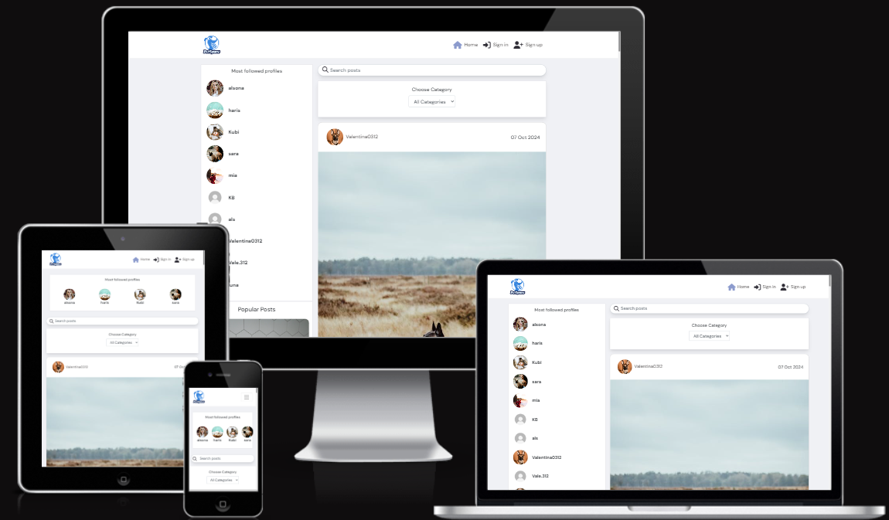

 

<h2>PetSpace frontend</h2>

PetSpace is a Full-Stack web application designed to facilitate content sharing among users, similar to Instagram. Utilizing Django Rest Framework for the back-end and React for the front-end, the application provides a seamless user experience for browsing, posting, and interacting with content.
 
 
Visit the website: [PetSpace](https://petspace-frontend-4974c05787c4.herokuapp.com/)
 

<h1 id="contents">Contents</h1>

-   [Introduction](#introduction)
-   [Live Site](#demo)
    -   [Backend API repository](#demo)
-   [User Experience - UX](#user-experience)
    -   [User Stories](#user-stories)
    -   [Agile Methodology](#agile-methodology)
    -   [The Scope](#the-scope)
-   [Design](#design)
    -   [Colours](#colours)
    -   [Typography](#typography)
    -   [Media](#media)
    -   [Wireframes](#wireframes)
-   [Features](#features)
    -   [Homepage](#homepage)
    -   [Navigation Desktop](#navigation-desktop)
    -   [Navigation Mobile](#navigation-mobile)
    -   [Petspace Details](#foodsnap-details)
    -   [Petspace Sidebar](#foodsnap-sidebar)
    -   [Petspace Feed](#feed)
    -   [Liked Posts](#liked-foodsnaps)
    -   [Search Results](#search-results)
    -   [Profile](#profile)
    -   [Future Features](#future-features)
-   [Technologies](#technologies)
    -   [Languages](#languages)
    -   [React Packages](#react-packages)
    -   [Frameworks & Libraries](#frameworks)
-   [Development](#development)
    -   [Custom Components](#custom-components)
    -   [Custom Hooks](#custom-hooks)
    -   [Contexts](#custom-contexts)
    -   [React Component Diagram](#component-diagram)
-   [Testing](TESTING.md)
    -   [Automated Jest Testing Results](#testing-results)
    -   [Manual Testing Results](#testing-results)
    -   [Bugs](TESTING.md#bugs)
-   [Deployment](#deployment)
-   [Credits](#credits)

<h1 id="introduction">Introduction</h1>
Project Milestone 5 for Code Institute Full-stack development program. PetSpace - is a frontend React.js project that runs on Heroku.

This app allows users to upload posts then create, edit, add comments and add recipes from the frontend once registered & logged in.

<h1 id="demo">Live Site</h1>
A live version of the site can be found <a href="https://petspace-frontend-4974c05787c4.herokuapp.com/" target="_blank">HERE</a>  

This repository is the frontend for PetSpace utilising React.js.

The backend API repository can be found <a href="https://petspace-api-195e436e05ae.herokuapp.com/" target="_blank">HERE </a>  

  

<h1 id="user-experience">User Experience - UX</h1>

<a href="#top">Back to the top.</a>

<h2 id="user-stories">User Stories</h2>

| Category  | as      | I want to                      | so that I can                                                                                    | UI components                                |
| --------- | ------- | ------------------------------ | ------------------------------------------------------------------------------------------------ | -------------------------------------------- |
| auth      | user    | register for an account        | have a personal profile with a picture                                                           | SignUpForm ProfilePage ProfileEditForm |
| auth      | user    | register for an account        | create, like and comment on posts                                                                | Post PostPage Comment                  |
| auth      | user    | register for an account        | follow users                                                                                     | Profile ProfilePage                       |
| posts     | visitor | view a list of posts           | browse the most recent uploads                                                                   | PostsPage                                    |
| posts     | visitor | view an individual post        | see user feedback, i.e. likes and read comments                                                  | Post PostPaget                            |
| posts     | visitor | search a list of posts         | find a post by a specific artist or a title                                                      | PostsPage                                    |
| posts     | visitor | scroll through a list of posts | browse the site more comfortably                                                                 | InfiniteScrollComponent                      |
| posts     | user    | edit and delete my post        | correct or hide any mistakes                                                                     | PostEditForm MoreDropdownMenu             |
| posts     | user    | create a post                  | share my moments with others                                                                     | PostCreateForm                               |
| posts     | user    | view liked posts               | go back often to my favourite posts                                                              | PostsPage                                    |
| posts     | user    | view followed users' posts     | keep up with my favourite users' moments                                                         | PostsPage                                    |
| likes     | user    | like a post                    | express my interest in someone's shared moment                                                   | Post like icon                               |
| likes     | user    | unlike a post                  | express that my interest in someone's shared moment has faded away                               | Post (un) like icon                          |
| likes     | user    | like a comment                    | express my interest in someone's shared opinion                                                   | Comment like icon                               |
| likes     | user    | unlike a comment                  | express that my interest in someone's shared opinion has faded away                               | Comment (un) like icon                          |
| likes     | user    | see the most liked posts                 | see what posts are the most favorites                               | PopularPosts icon                          |
| comments  | user    | create a comment               | share my thoughts on other people's content                                                      | PostPage CommentCreateForm                |
| comments  | user    | edit and delete my comment     | correct or hide any mistakes                                                                     | PostPage Comment MoreDropdownMenu      |
| profiles  | user    | view a profile                 | see a user's recent posts + post, followers, following count data                                | ProfilePage Post                          |
| profiles  | user    | edit a profile                 | update my profile information                                                                    | ProfileEditForm                              |
| followers | user    | follow a profile               | express my interest in someone's content                                                         | Profile follow button                        |
| followers | user    | unfollow a profile             | express that my interest in someone's content has faded away and remove their posts from my feed | Profile (un) follow button 
| category | user    | create a category               | add that category to the database so other users can use it too while creating a post |AddCategory                               |
| category | user    | choose a category               | filter the posts through | ChooseCategory            |

<h2 id="agile-methodology">Agile Methodology</h2>

