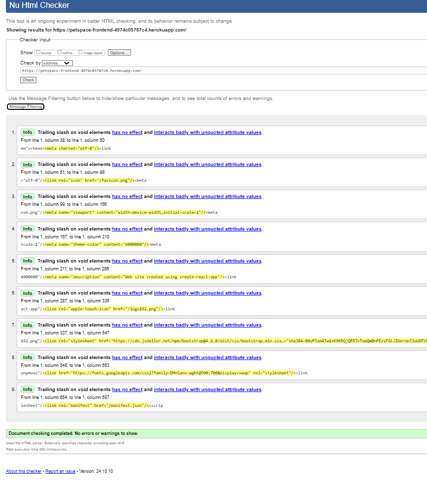
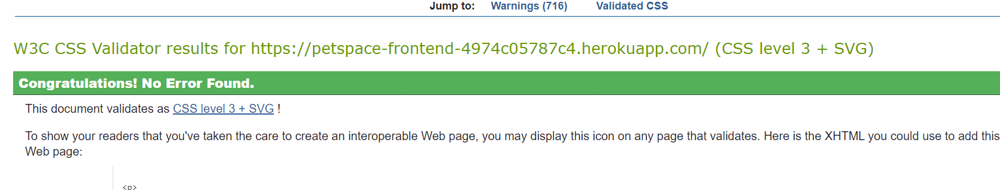
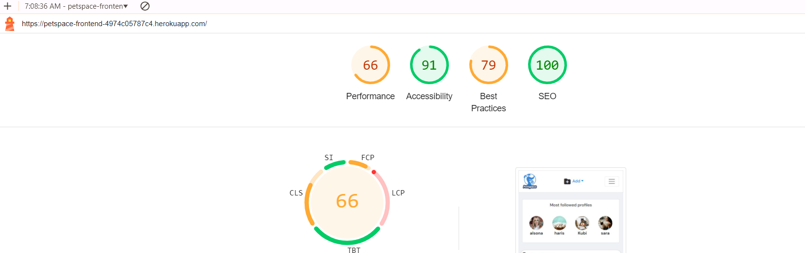

<h1 id="contents">foodSNAP Frontend Testing</h1>

Back to the [README](README.md)

<h1 id="contents">Contents</h1>

-   [Introduction](#introduction)
-   [Manual Functional Testing](#manual-testing)
-   [Automated Jest Testing](#automated-testing)
-   [ESlint Validator](#eslint-validation)
-   [HTML Validator](#html-validation)
-   [CSS Validator](#css-validation)
-   [Lighthouse Results](#lighthouse)
-   [Bugs / Issues](#bugs)

<h1 id="introduction">Introduction</h1>

Project Milestone 5 for Code Institute Full-stack development program. PetSpace - all testing results and code validation are listed below.<br>
Testing has taken place continuously throughout the development of the project. The app was tested regularly and deployed early to Heroku to confirm local and remote functioned the same.

<h1 id="manual-testing">Manual Functional Testing Results</h1>

<a href="#top">Back to the top</a>

| Status | **Authentication - User Logged Out**
|:-------:|:--------|
| &check; | Typing 'https://petspace-frontend-4974c05787c4.herokuapp.com/' url into the browser, the user can not access the home page.
| &check; | Typing 'https://petspace-frontend-4974c05787c4.herokuapp.com/signin' url into the browser, the user can sign in.
| &check; | Typing 'https://petspace-frontend-4974c05787c4.herokuapp.com/signup' url into the browser, the user can sign up. 

| Status | **Navigation - User Logged Out**
|:-------:|:--------|
| &check; | Clicking the navbar brand logo loads the home page
| &check; | Clicking the Home button on the nav bar re-loads the home page
| &check; | Clicking the Sign In button on the nav bar loads the sign up page
| &check; | Clicking the Sign Up button on the nav bar loads the sign in page
| &check; | The user can not see the profile page link in the navigation bar profile section dropdown menu
| &check; | The user can not see the sign out link in the navigation bar profile section dropdown menu
| &check; | Users can not see the Feed menu option in the navigation bar
| &check; | Users can not see the Liked menu option in the navigation bar
| &check; | Users can not see the 'Add' button in the navigation bar to add post or category.
| &check; | Tablet and mobile users can see the navigation bar options in a burger menu dropdown
| &check; | Clicking a link from the navigation bar links automatically closes the burger menu
| &check; | User can not sign in with false credentials - warning message displayed
| &check; | User can not sign in without filling out all the input fields - warning message displayed
| &check; | User can not sign up without filling out all the input fields - warning message displayed
| &check; | User can not sign up if the two password fields don't match - warning message displayed
| &check; | User can not sign up if the username chosen already exists in the database - warning message displayed

| Status | **Homepage - User Logged Out**
|:-------:|:--------|
| &check; | Users can view the Popular Profiles component
| &check; | Users can view the Popular Posts component
| &check; | Users can not view the follow button under each Popular Profile
| &check; | Clicking on a popular profile avatar, users are redirected to the selected profile page
| &check; | Desktop and tablet users can view the Popular Posts component on the left.
| &check; | Mobile users can view the Popular Posts component.
| &check; | Users can view all posts - title, description, posts date, image and category
| &check; | Users can view the liked count
| &check; | Users can view the comments count
| &check; | Clicking on an post image, users are redirected to the selected post detail page
| &check; | Clicking on an post comments count, users are redirected to the selected post detail page
| &check; | Clicking on an post owner avatar, users are redirected to the selected profile page
| &check; | Users can search for a particular post by typing in the search bar, the username of the post owner or the post title. 
| &check; | Users can filter the list of events by selecting a category from the category dropdown

| Status | **Profile Page - User Logged Out**
|:-------:|:--------|
| &check; | Users can view the Popular Profiles component
| &check; | Clicking on a popular profile avatar, users are redirected to the selected profile page
| &check; | Desktop and tablet users can view the most  followed profiles component on the right
| &check; | Users can view the number of posts the profile owner has posted
| &check; | Users can view the number of followers the selected profile has
| &check; | Users can view the number of other profiles the selected profile is following
| &check; | Users can view the posts which were posted by the selected profile
| &check; | Clicking on the post image, users are redirected to the selected event detail page
| &check; | Clicking on the liked button, users are advised to loglog in to like a post. 
| &check; | Clicking on the comment button, users are advised to logolog in to comment a post.

| Status | **Navigation - User Logged In**
|:-------:|:--------|
| &check; | Clicking the navbar brand logo loads the home page
| &check; | Clicking the Home button on the nav bar re-loads the home page
| &check; | User can't see the sign in button in the navigation bar profile section dropdown menu
| &check; | User can't see the sign up button in the navigation bar profile section dropdown menu
| &check; | The user can see the profile page link in the navigation bar profile section dropdown menu
| &check; | The user can see the sign out link in the navigation bar profile section dropdown menu
| &check; | Users can see the Feed menu option in the navigation bar
| &check; | Users can see the Liked menu dropdown in the navigation bar
| &check; | Users can see the 'Add' button in the navigation bar
| &check; | Tablet and mobile users can see the navigation bar options in a burger menu dropdown
| &check; | Clicking a link from the navigation bar links automatically closes the burger menu
| &check; | User can view their avatar image next to the profile page link

| Status | **Homepage - User Logged In**
|:-------:|:--------|
| &check; | Users can view the Popular Profiles component
| &check; | Users can view the Popular Posts component
| &check; | Clicking on a popular profile avatar, users are redirected to the selected profile page
| &check; | Users can view the follow button under each Popular Profile
| &check; | Clicking on a popular profile follow button, users can become a follower of the selected profile
| &check; | Desktop and tablet users can view 6 Popular Profiles and 4 Popular Posts component on the left.
| &check; | Mobile users can view only 4 Popular profiles.
| &check; | Clicking on a post, users are redirected to the selected post detail page
| &check; | Users can view all posts posted to the site - title, description, event date, image and category from the latest;
| &check; | Users can view the liked count
| &check; | Users can view the comment count
| &check; | Users can view the likes of comments count after clicking on a post
| &check; | Clicking on the liked button, like of posts count goes up and down on a toggle
| &check; | If the logged in user is the post owner, user can not click the liked button - tooltip warning given
| &check; | If the user clicks like icon, having previously clicked it, tooltip warning given
| &check; | Clicking on an post comments count, users are redirected to the selected post detail page
| &check; | Clicking on an post owner avatar, users are redirected to the selected profile page
| &check; | Users can search for a particular post by typing in the post title, the username of the event owner.
| &check; | Users can filter the list of posts by selecting a category from the category dropdown

| Status | **Add Post Page - User Logged In**
|:-------:|:--------|
| &check; | Users can view the empty form to create a new post
| &check; | Users can upload an image into the form
| &check; | Users can change an uploaded image

| Status | **Feed - User Logged In**
|:-------:|:--------|
| &check; | Users can view the Popular Profiles component
| &check; | Users can view the Popular Post component
| &check; | Clicking on a popular profile avatar, users are redirected to the selected profile page
| &check; | Users can view the follow button under each Popular Profile
| &check; | Clicking on a popular profile follow button, users can become a follower of the selected profile
| &check; | Desktop and tablet users can view the most followed profiles component on the left
| &check; | Mobile users can view only 4 most followed profiles.
| &check; | Clicking on a post, users are redirected to the selected post detail page
| &check; | Users can view all posts posted by profiles they follow - title, description, event date, image and category.
| &check; | Users can view the like post's count
| &check; | Users can view the like comment's count
| &check; | Users can view the comments count
| &check; | Users see a new results found message if they dont' follow any profiles, or the profiles they follow haven't posted any events
| &check; | Clicking on the liked button, interested count goes up and down on a toggle
| &check; | If the logged in user is the post owner, user can not click the interested button - tooltip warning given
| &check; | Clicking on an post comments count, users are redirected to the selected post detail page
| &check; | Clicking on an post owner avatar, users are redirected to the selected profile page
| &check; | Users can search for a particular event by typing in the event title, the username of the event owner.
| &check; | Users can filter the list of events by selecting a category from the category dropdown

| Status | **Liked - User Logged In**
|:-------:|:--------|
| &check; | Users can view the Popular Profiles component
| &check; | Users can view the Popular Posts component
| &check; | Clicking on a popular profile avatar, users are redirected to the selected profile page
| &check; | Users can view the follow button under each Popular Profile
| &check; | Clicking on a popular profile follow button, users can become a follower of the selected profile
| &check; | Desktop and tablet users can view the Top Profiles component on the left
| &check; | Desktop and tablet users can view the Top Posts component on the left
| &check; | Clicking on a top posts, users are redirected to the selected post detail page
| &check; | Users can view all posts where they have clicked the liked button.
| &check; | Users see a new results found message if they haven't clicked liked on any post.
| &check; | Users can view the like post's count
| &check; | Users can view the like comment's count
| &check; | Users can view the comments count
| &check; | Clicking on the liked button, like's count goes up and down on a toggle
| &check; | Clicking on an post's comments count, users are redirected to the selected post detail page
| &check; | Clicking on an event owner avatar, users are redirected to the selected profile page
| &check; | Users can search for a particular event by typing in the post title, the username of the event owner.
| &check; | Users can filter the list of events by selecting a category from the category dropdown

| Status | **Post Detail Page - User Logged In**
|:-------:|:--------|
| &check; | Users can view the Popular Profiles component
| &check; | Users can view the Popular Posts component
| &check; | Clicking on a popular profile avatar, users are redirected to the selected profile page
| &check; | Desktop and tablet users can view the Top Profiles component on the left
| &check; | Clicking on a post title, users are redirected to the selected post detail page
| &check; | Users can view details of a single post - title, description, event date, image and category
| &check; | Users can view the post's like count
| &check; | Users can view the comments's like count
| &check; | Users can view the comments count
| &check; | Clicking on an post owner avatar, users are redirected to the selected profile page
| &check; | Clicking on the like button, like's count goes up and down on a toggle
| &check; | If the logged in user is the post owner, user can not click the like button - tooltip warning given
| &check; | Users can view any published comments posted about this post
| &check; | Users can view the create comment form
| &check; | Users can type into the comment form and submit a comment to the event
| &check; | On submitting a comment, the comment count increases by 1
| &check; | If the logged in user is the owner of a published comment, they can see the three dots edit/delete menu next to it
| &check; | User can edit their own comments via the three dots edit/delete menu
| &check; | User can delete their own comments via the three dots edit/delete menu
| &check; | On deleting a comment, the comment count decreases by 1
| &check; | If the logged in user is the owner of the post, they can see the three dots edit/delete menu next to the created_at date
| &check; | User can edit their own post via the three dots edit/delete menu
| &check; | On clicking edit post, user is redirected to the edit post page
| &check; | User can delete their own posts via the three dots edit/delete menu

| Status | **Edit Post Page - User Logged In**
|:-------:|:--------|
| &check; | Users can view the post form pre-populated with the current post details
| &check; | Users can upload an image into the form
| &check; | Users can change an uploaded image
| &check; | Users can change the title, description and category.

| Status | **Profile Page - User Logged In**
|:-------:|:--------|
| &check; | Users can view the Popular Profiles component
| &check; | Clicking on a popular profile avatar, users are redirected to the selected profile page
| &check; | Users can view the number of posts the profile owner has posted
| &check; | Users can view the number of followers the selected profile has
| &check; | Users can view the number of other profiles the selected profile is following
| &check; | Users can view the posts which were posted by the selected profile
| &check; | Clicking on the post image, users are redirected to the selected post detail page
| &check; | Clicking on the like button, the count goes up and down on a toggle
| &check; | If the logged in user is the post owner, user can not click the like button - tooltip warning given
| &check; | Clicking on an post comments count, users are redirected to the selected post detail page
| &check; | If the user is viewing their own profile page, they can see the three dots edit profile menu next to the profile stats
| &check; | Users can edit their own profile page via the three dots edit/delete menu
| &check; | On clicking edit profile, user is redirected to the edit profile page
| &check; | User can edit their own username via the three dots edit profile menu
| &check; | User can edit their own password via the three dots edit profile menu

| Status | **Edit Profile Page - User Logged In**
|:-------:|:--------|
| &check; | Users can view the profile form pre-populated with the current profile details
| &check; | Users can upload an avatar image into the form
| &check; | Users can change the uploaded image

<h1 id="automated-testing">Automated Jest Testing Results</h1>

Jest was setup for testing by adding the below code to the setupTests.js file to utilise the mocks/handlers.js file to simulate a user logging in and out.
It also starts the simulated browser and shuts it down after each test is run.
The handlers.js creates a user object and accesses the base url and dj-rest-auth/logout/ to test user authentication.

```
import "@testing-library/jest-dom";
import { setupServer } from "msw/node";
import { handlers } from "./mocks/handlers";

const server = setupServer(...handlers);

beforeAll(() => server.listen());
afterEach(() => server.resetHandlers());
afterAll(() => server.close());
```

Created 4 tests utilising the Jest testing suite

-   [NavBar.test.js](https://github.com/alsona1188/petspace_frontend-pp5/blob/main/src/components/__tests__/NavBar.test.js) 3 NavBar tests to see if the correct navigation links are shown to a logged in user versus a logged out user in the header.

```
test("renders NavBar", () => {
  render(
    <Router>
      <NavBar />
    </Router>
  );

  // screen.debug();
  const signInLink = screen.getByRole("link", { name: "Sign in" });
  expect(signInLink).toBeInTheDocument();
});

test("renders Sign in and Sign up buttons again on log out", async () => {
    render(
      <Router>
        <CurrentUserProvider>
          <NavBar />
        </CurrentUserProvider>
      </Router>
    );
  
    const profileAvatar = await screen.findByText("Profile");
    expect(profileAvatar).toBeInTheDocument();

});

test("renders Sign in and Sign up buttons again on log out", async () => {
    render(
      <Router>
        <CurrentUserProvider>
          <NavBar />
        </CurrentUserProvider>
      </Router>
    );
  
    const signOutLink = await screen.findByRole("link", { name: "Sign out" });
    fireEvent.click(signOutLink);
  
    const signInLink = await screen.findByRole("link", { name: "Sign in" });
    const signUpLink = await screen.findByRole("link", { name: "Sign up" });
  
    expect(signInLink).toBeInTheDocument();
    expect(signUpLink).toBeInTheDocument();
  });

```

-   [Avatar.test.js](https://github.com/alsona1188/petspace_frontend-pp5/blob/main/src/components/__tests__/NavBar.test.js) to render the avatar component.

```
import React from 'react';
import { render } from '@testing-library/react';
import { BrowserRouter as Router } from 'react-router-dom';
import Avatar from '../Avatar';

describe('Avatar renders', () => {
  const renderComponent = () =>
    render(
      <Router>
        <Avatar />
      </Router>,
    );

  test('renders the avatar component', () => {
    renderComponent();
  });
});
```

-   All tests passed

<a href="#top">Back to the top</a>

<h1 id="eslint-validation">ESLint Validation</h1>

<a href="#top">Back to the top</a>

All validation fixes recommended by ESLint were fixed and the follwing rules added to the .eslintrc.json configuration file.
The code now validates with ESLint

```
 "rules": {
    "react/react-in-jsx-scope": "off",
    "react/prop-types": "off",
    "no-unused-vars": ["warn", { "argsIgnorePattern": "req|res|next|__" }],
    "allowEmptyCatch": 0,
    "no-undef": "off",
    "react/display-name": "off"
    }
```
<h1 id="html-validation">HTML Validation</h1>



<h1 id="css-validation">CSS Validation</h1>



<h1 id="lightHouse">Lighthouse</h1>

Lighthouse was used to test Performance, Best Practices, Accessibility and SEO on Desktop and Mobile.



<h1 id="bugs">Bugs</h1>

<a href="#top">Back to the top</a>

Bug: Unable to create a post:
- solution: After contacting tutor support, we found out that the frontend database was not corresponding to the backend database even though was the same. I need to thank the support because they suggested to change the database, complete new. After that everything was working. 

Back to the [README](README.md)

